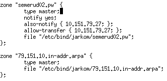
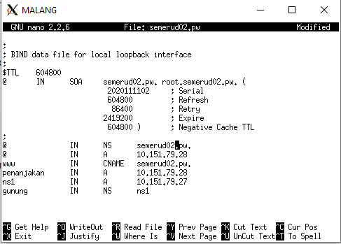
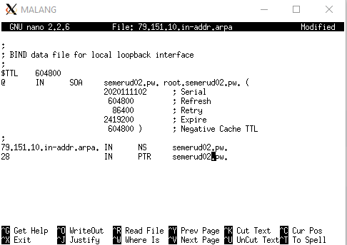
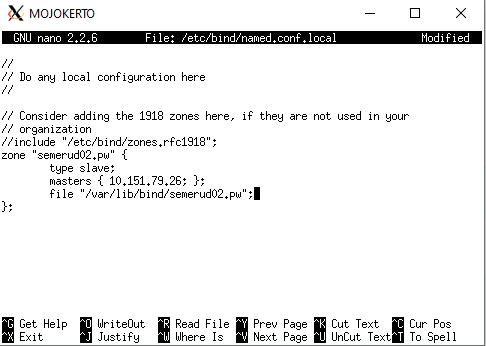
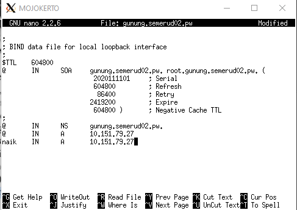
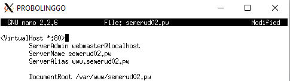

# Jarkom_Modul2_Lapres_D02
## Laporan Resmi Praktikum Modul 2 Jaringan Komputer 2020
**Kelompok D02**

-Calvin Wijaya 05111840000086

-Alie Husaini R. 05111840000097

##### 1. Membuat domain dengan mengisikan konfigurasi untuk semerud02.pw di MALANG

##### 2. Membuat alias
##### 3. Membuat subdomain

##### 4. Membuat reverse domain

##### 5. Membuat DNS Server Slave

##### 6. Membuat subdomain di delagasikan ke MOJOKERTO dan mengarah ke PROBOLINGGO

##### 7. Membuat subdomain naik.gunung.semerud02.pw

##### 8. Mengatur webserver untuk domain semerud02.pw

